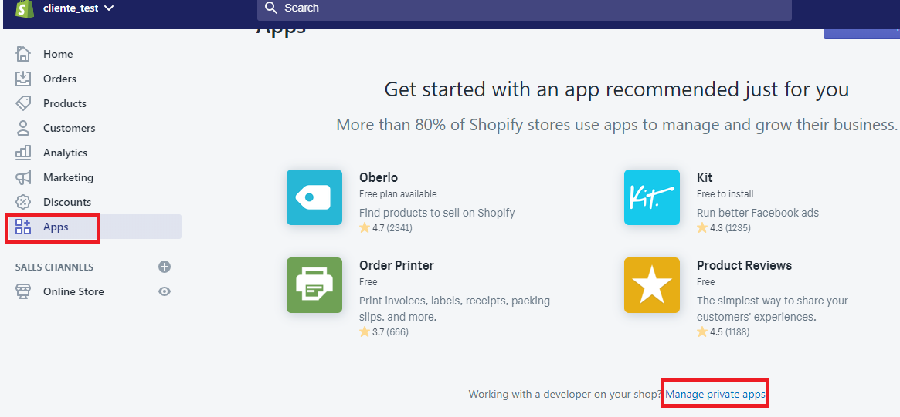
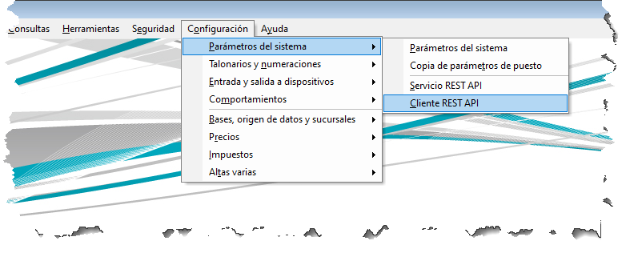
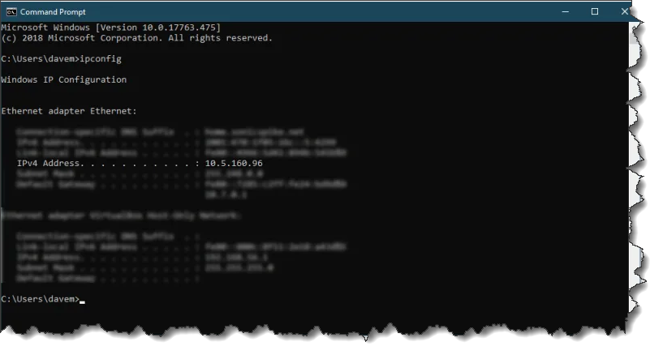
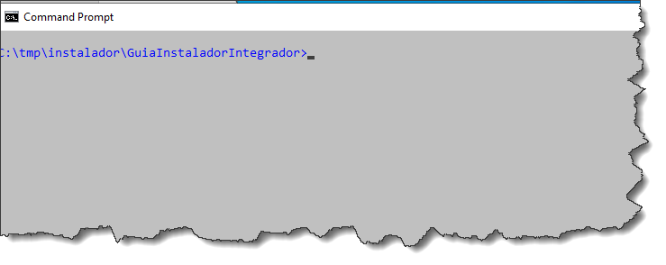
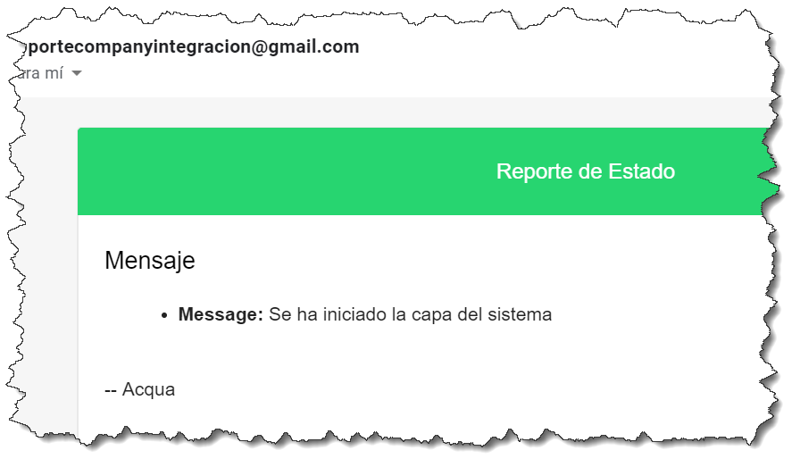
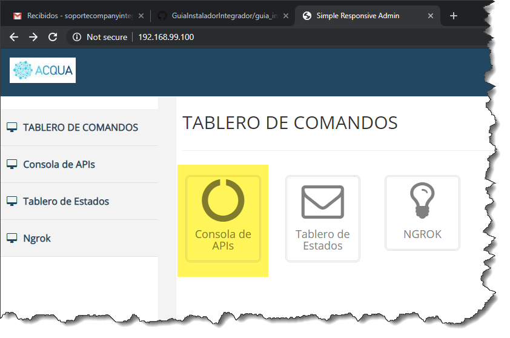

== Contents

link:#requisitos[Requisitos 2]

link:#requisitos-para-instalar-docker-desktop-para-windows[Requisitos para Instalar *Docker Desktop* para Windows 2]

link:#requisitos-para-instalar-docker-toolbox-para-windows[Requisitos para Instalar *Docker Toolbox* para Windows 2]

link:#verificación-del-equipo-para-instalar-docker-toolbox-para-windows[Verificación del equipo para Instalar *Docker Toolbox* para Windows 3]

link:#configuración-shopify[Configuración Shopify 4]

link:#como-crear-un-store-de-prueba[Como crear un store de prueba 4]

link:#logearse-en-shopify[Logearse en Shopify 4]

link:#agregar-un-store-nuevo[Agregar un Store nuevo 4]

link:#cargar-la-información-requerida[Cargar la información requerida 4]

link:#generar-la-clave-privada-de-un-store-existente[Generar la Clave privada de un Store existente 6]

link:#consulta-de-una-clave-privada-de-un-store-existente[Consulta de una Clave privada de un Store existente 9]

link:#configurar-dragonfish[Configurar DragonFish 10]

link:#instalar-git-windows[Instalar GIT Windows 13]

link:#instalar-docker[Instalar Docker 14]

link:#crear-una-cuenta-gmail-para-recibir-las-notificaciones.[Crear una cuenta GMAIL para recibir las notificaciones. 17]

link:#creación-de-una-cuenta-ngrok[Instalación NGROK 20]

link:#descargar-instalador-del-servicio[Descargar Instalador del Servicio 24]

link:#instalar-servicio-de-integración-dragonfishshopify[Instalar Servicio de Integración DragonFish/Shopify 29]

link:#finalizar-los-servicios-en-modo-controlado.[Finalizar los Servicios en modo controlado. 32]

link:#verificar-conectividad-de-los-servicios[Verificar Conectividad de los Servicios 33]

link:#_Toc16585582[Apache MQ 33]

link:#estado-de-los-servicios[Estado de los Servicios 33]

== Requisitos

El sistema de integración MIRRIT está desarrollado sobre tecnología de virtualización.

Esta tecnología permite simplificar la gestión y administración de los sistemas.

Mirrit requiere tener instalado *Docker Desktop for Windows* o en su defecto una versión alternativa *Docker Toolbox*.

=== Requisitos para Instalar *Docker Desktop* para Windows

https://docs.docker.com/docker-for-windows/install/

Para esta herramienta require contar con la siguiente configuración:

____
• Windows 10 64bit: Pro, Enterprise or Education (Build 15063 or later).

• Virtualization is enabled in BIOS.

• CPU SLAT-capable feature.

• At least 8GB of RAM.
____

Si el Sistema donde se instala no cuenta con estos requerimientos mínimos se puede instalar una versión alternativa *Docker Toolbox*.

=== Requisitos para Instalar *Docker Toolbox* para Windows

Esta herramienta usa *Oracle Virtual Box* en vez de *Hyper-V*. Por lo que los requisitos son menores.

____
• Windows 10 64bit. (No se recomienda Windows 7)

• Virtualization is enabled in BIOS

• CPU SLAT-capable feature.

• At least 8GB of RAM.
____

=== Verificación del equipo para Instalar *Docker Toolbox* para Windows

En la sección “*Step 1: Check your version*”del dirección https://docs.docker.com/toolbox/toolbox_install_windows/ se podrán seguir los pasos para verificar si cumple los requisitos mínimos.

Al menos se requiere un sistema operativo Windows 64 bits corriendo sobre Windows 7 o superior.

De todas formas, se recomienda uso de Windows 10 64 bits.

Seguir la siguiente guía:

== Configuración Shopify

=== Como crear un store de prueba

==== Logearse en Shopify

image:extracted-media/media/image2.png[image,width=624,height=122]

==== Agregar un Store nuevo

==== Cargar la información requerida

image:extracted-media/media/image4.png[image,width=624,height=295]

image:extracted-media/media/image5.png[image,width=624,height=276]

=== Generar la Clave privada de un Store existente

En este caso obtendremos la clave del store recién creado.

Crear una nueva clave

Ingresar la información requerida y los permisos.

image:extracted-media/media/image9.png[image,width=624,height=408]

Confirmar.

Confirmación de la clave creada.

image:extracted-media/media/image11.png[image,width=332,height=86]

De la siguiente pantalla se requiere anotar tanto el APIKey como la Password pues deberán ser ingresada como parámetros

De la siguiente pantalla se requiere la versión del API.

image:extracted-media/media/image14.png[image,width=354,height=266]

=== Consulta de una Clave privada de un Store existente

== Configurar DragonFish

Activar el servicio REST de DragonFish siguiendo la guía:

[arabic]
. Crear un servicio REST API

[arabic, start=2]
. Crear un cliente REST API

Activar y obtener la clave para que el Sistema de Integración DragonFish/Shopify pueda acceder.

Los valores requeridos en la configuración son los siguientes:

image:extracted-media/media/image19.png[C:\Users\jgodi\AppData\Local\Temp\SNAGHTMLab431af.PNG,width=362,height=210]

Es importante correr un proceso dentro de DragonFish para activar la funcionalidad.

____
"C:\Program Files (x86)\Zoo Logic\Dragonfish Color y Talle\DRAGONFISH_Core.Exe" "C:\Program Files (x86)\Zoo Logic\Dragonfish Color y Talle\scriptinicioapi_20190620190126AL1ONB_8008.sz"
____

Donde el número 20190620190126AL1ONB corresponde al Servicio REST de la pantalla anterior.

Ejecutarlos desde TASK en el Task Manager:

== Instalar GIT Windows

https://gitforwindows.org/

== Instalar Docker

Si cumple los requisitos para instalar *Docker Desktop*

https://docs.docker.com/docker-for-windows/install/

Si no cumple los requisitos para instalar *Docker Desktop* se debe considerar *Docker Toolbox*

https://docs.docker.com/toolbox/toolbox_install_windows/

El link resaltado apunta a:

https://github.com/docker/toolbox/releases

== Crear una cuenta GMAIL para recibir las notificaciones.

Ingresar a https://gmail.com/[https://gmail.com]

*Cuenta*: soporteCompanyIntegracion@gmail.com

*Clave*: Soporte2019!

Activar IMAP

image:extracted-media/media/image27.png[C:\Users\jgodi\AppData\Local\Temp\SNAGHTMLa6093fc.PNG,width=453,height=232]

Debe guardar los cambios.

image:extracted-media/media/image28.png[C:\Users\jgodi\AppData\Local\Temp\SNAGHTMLa61c596.PNG,width=376,height=225]

Activar Acceso de Aplicaciones Poco Seguras

image:extracted-media/media/image29.png[C:\Users\jgodi\AppData\Local\Temp\SNAGHTMLa817392.PNG,width=222,height=143]

== Creación de una cuenta NGROK

Sistema de Integración DragonFish-Shopify requiere utilizar NGROK. Este producto permite exponer los servicios a través de la red pública. Utiliza para ellos un túnel seguro.

Esto es requerido pues Shopify envía las notificaciones y para ello requiere una dirección pública de internet. En caso de contar con una dirección IP fija, este producto no es requerido.

NGROK es producto es un producto libre con algunas limitaciones. Se pueden extender estas limitaciones cambiando a un plan pago. Para más detalle visitar el sitio: https://ngrok.com/pricing

Para obtener una clave libre, ingresar a

https://dashboard.ngrok.com/get-started

Es recomendable utilizar una cuenta de Gmail.

image:extracted-media/media/image32.png[C:\Users\jgodi\AppData\Local\Temp\SNAGHTML10e35afd.PNG,width=513,height=213]

Conservar el Authtoken pues se requiere para la configuración posterior.

== Descargar Instalador del Servicio

Abrir la línea de comandos y ejecutar lo siguente:

git clone https://github.com/AcquaNet/GuiaInstaladorIntegrador.git

Ingresar a la carpeta descargada

image:extracted-media/media/image34.png[C:\Users\jgodi\AppData\Local\Temp\SNAGHTMLa148dc3.PNG,width=353,height=332]

Editar archivo *.env* y cambiar los parámetros

image:extracted-media/media/image36.png[C:\Users\jgodi\AppData\Local\Temp\SNAGHTMLb3a32ad.PNG,width=427,height=120]

Ingresar valores enviados por mail.

image:extracted-media/media/image37.png[C:\Users\jgodi\AppData\Local\Temp\SNAGHTMLb3167f2.PNG,width=624,height=202]

En caso que se desee utilizar otra cuenta SMTP debe cambiarse estos valores.

EMAIL

[cols=",",options="header",]
|===
|*PARAMETRO* |*VALOR*
|dragon_shopify_smtp_host |smtp.gmail.com
|dragon_shopify_smtp_port |465
|dragon_shopify_smtp_user |soportecompanyintegracion@gmail.com
|dragon_shopify_smtp_pass |Soporte2019!
|===

DRAGON

[cols=",",options="header",]
|===
|*PARAMETRO* |*VALOR*
|Dragon_URL_Base |http://192.168.99.1:8008/api.Dragonfish
|Dragon_Conf_Cliente a|
Codigo que se obtiene de la confirmación de Cliente REST API

image:extracted-media/media/image39.png[image,width=217,height=148]

|Dragon_Clave_Privada_Conf_Cliente |Clave privada del Cliente REST API
|Dragon_User |Usuario de Dragon
|Dragon_Password |Clave de Usuario de Dragon
|===

[cols=",",options="header",]
|===
|*PARAMETRO* |*VALOR*
|Dragon_Lista_De_Precios |Lista de Precios de Dragon a utilizar para la captura de precios.
|===

Como determinar la dirección *Dragon_URL_Base*.

La dirección IP debe tomar la dirección IPV4 donde está corriendo el servicio y el puerto se puede obtener escaneando el QR.

[cols=",",]
|===
|*PARAMETRO* |*VALOR*
|===

[cols=",",options="header",]
|===
|Shopify_API_Host |Ingrese la dirección de Shopify. Ej. acquait.myshopify.com
|Shopify_API_Port |Utilizar el puerto seguro. No debe cambiar. Es 443
|Shopify_API_BasePath |Base del API a utilizar. Ej. /admin/api/2019-04/
|Shopify_API_Key |Clave privada generada previamente
|Shopify_API_Password |Clave privada generada previamente
|Shopify_Webhooks_url |Si los servicios corren dentro de una PC local, debe ejecutarse previamente un programa NGROK para exponer la dirección privada como pública. Ver último punto. Ejemplo *1305803f.ngrok.io*
|Shopify_Webhooks_topics |No modificar
|===

== Instalar Servicio de Integración DragonFish/Shopify

Ingresar a la terminal *Docker Quickstart Terminal*

Ingresar a la línea de comandos de Windows

image:extracted-media/media/image43.png[C:\Users\jgodi\AppData\Local\Temp\SNAGHTML25d3c6.PNG,width=232,height=129]

Ingresar a la de la carpeta donde se desacargó la GuiaInstaladorIntegrador

Luego ejecutar el siguiente comando:

docker-compose up --no-start

image:extracted-media/media/image45.png[C:\Users\jgodi\AppData\Local\Temp\SNAGHTMLb3b0e86.PNG,width=624,height=184]

Iniciar luego los servicios

docker-compose start

image:extracted-media/media/image46.png[C:\Users\jgodi\AppData\Local\Temp\SNAGHTMLb3b89e0.PNG,width=624,height=298]

== Finalizar los Servicios en modo controlado.

Como finalizar los servicios en modo controlado.

docker exec -it mule-server /opt/mule/mule-standalone-3.9.0/bin/mule stop

docker-compose stop

==  +
Verificar Conectividad de los Servicios

Verificar la dirección asignada por Docker. Para ello ingresar a

Verificar accediendo a la consola

=== Verificar que el sistema haya arrancado.

Verificar que se hayan recibido dos email a la dirección configurada aquí:

image:extracted-media/media/image37.png[C:\Users\jgodi\AppData\Local\Temp\SNAGHTMLb3167f2.PNG,width=624,height=202]

image:extracted-media/media/image51.png[C:\Users\jgodi\AppData\Local\Temp\SNAGHTML1a126c09.PNG,width=624,height=279]

=== Estado de los Servicios

Las credenciales son las siguientes:

*Username* 60d91d9307784c009e2bfe60561a3074

*Password* 8FAc58d7D71944C098CE95528e8948A3

