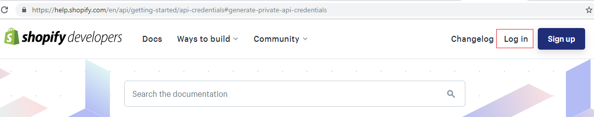
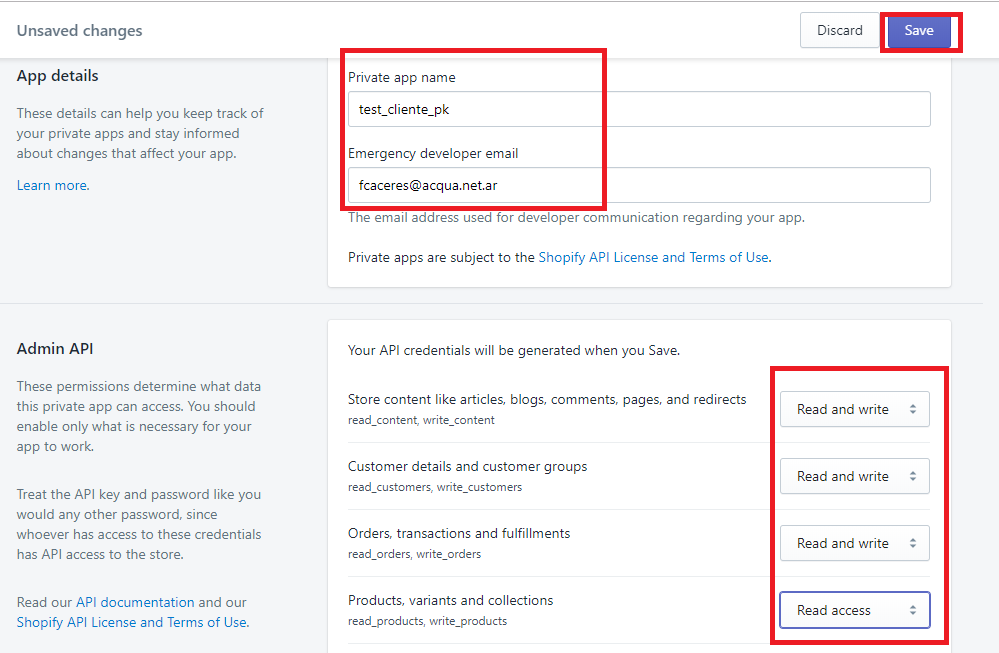
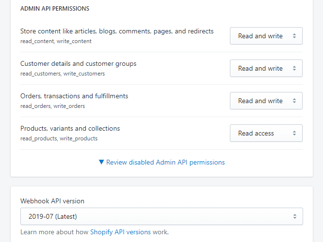
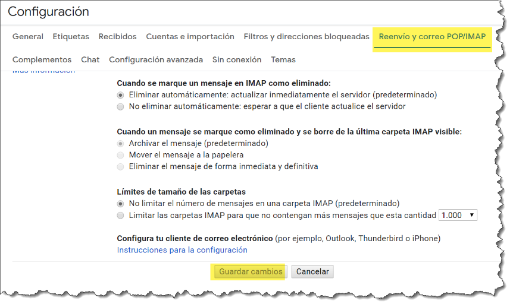
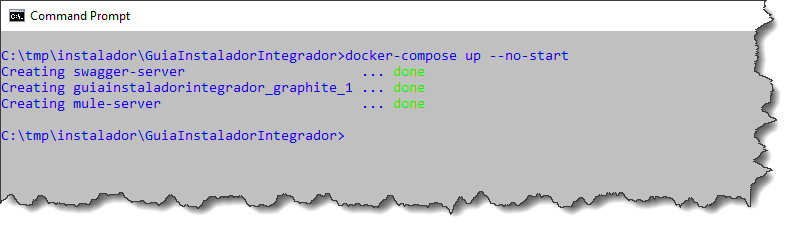

== Contents

link:#_Toc16009128[Configuración Shopify 1]

link:#como-crear-un-store-de-prueba[Como crear un store de prueba 1]

link:#logearse-en-shopify[Logearse en Shopify 2]

link:#agregar-un-store-nuevo[Agregar un Store nuevo 2]

link:#cargar-la-información-requerida[Cargar la información requerida 2]

link:#generar-la-clave-privada-de-un-store-existente[Generar la Clave privada de un Store existente 3]

link:#consulta-de-una-clave-privada-de-un-store-existente[Consulta de una Clave privada de un Store existente 6]

link:#configurar-dragonfish[Configurar DragonFish 8]

link:#instalar-git-windows[Instalar GIT Windows 10]

link:#instalar-docker[Instalar Docker 10]

link:#crear-una-cuenta-gmail-para-recibir-las-notificaciones.[Crear una cuenta GMAIL para recibir las notificaciones. 12]

link:#instalación-ngrok[Instalación NGROK 15]

link:#descargar-instalador-del-servicio[Descargar Instalador del Servicio 18]

link:#instalar-servicio-de-integración-dragonfishshopify[Instalar Servicio de Integración DragonFish/Shopify 23]

link:#finalizar-los-servicios-en-modo-controlado.[Finalizar los Servicios en modo controlado. 24]

link:#verificar-conectividad-de-los-servicios[Verificar Conectividad de los Servicios 25]

link:#apache-mq[Apache MQ 25]

link:#estado-de-los-servicios[Estado de los Servicios 25]

[#_Toc16009128 .anchor]##

== Configuración Shopify

=== Como crear un store de prueba

==== Logearse en Shopify

image:extracted-media/media/image1.png[image,width=624,height=122]

==== Agregar un Store nuevo

==== Cargar la información requerida

image:extracted-media/media/image3.png[image,width=624,height=295]

=== Generar la Clave privada de un Store existente

En este caso obtendremos la clave del store recién creado.

image:extracted-media/media/image6.png[image,width=624,height=289]

Crear una nueva clave

image:extracted-media/media/image7.png[image,width=384,height=226]

Ingresar la información requerida y los permisos.

image:extracted-media/media/image8.png[image,width=624,height=408]

Confirmar.

Confirmación de la clave creada.

image:extracted-media/media/image10.png[image,width=332,height=86]

De la siguiente pantalla se requiere anotar tanto el APIKey como la Password pues deberán ser ingresada como parámetros

image:extracted-media/media/image12.png[image,width=415,height=170]

De la siguiente pantalla se requiere la versión del API.

image:extracted-media/media/image13.png[image,width=354,height=266]

=== Consulta de una Clave privada de un Store existente

== Configurar DragonFish

Activar el servicio REST de DragonFish siguiendo la guía:

[arabic]
. Crear un servicio REST API

image:extracted-media/media/image15.png[C:\Users\jgodi\AppData\Local\Temp\SNAGHTMLc0b2508.PNG,width=624,height=255]

image:extracted-media/media/image16.png[C:\Users\jgodi\AppData\Local\Temp\SNAGHTMLc0abc0d.PNG,width=456,height=273]

[arabic, start=2]
. Crear un cliente REST API

image:extracted-media/media/image17.png[C:\Users\jgodi\AppData\Local\Temp\SNAGHTMLc0702ce.PNG,width=624,height=255]

Activar y obtener la clave para que el Sistema de Integración DragonFish/Shopify pueda acceder.

Los valores requeridos en la configuración son los siguientes:

image:extracted-media/media/image18.png[C:\Users\jgodi\AppData\Local\Temp\SNAGHTMLab431af.PNG,width=362,height=210]

Es importante correr un proceso dentro de DragonFish para activar la funcionalidad.

____
"C:\Program Files (x86)\Zoo Logic\Dragonfish Color y Talle\DRAGONFISH_Core.Exe" "C:\Program Files (x86)\Zoo Logic\Dragonfish Color y Talle\scriptinicioapi_20190620190126AL1ONB_8008.sz"
____

Donde el número 20190620190126AL1ONB corresponde al Servicio REST de la pantalla anterior.

Ejecutarlos desde TASK en el Task Manager:

== Instalar GIT Windows

https://gitforwindows.org/

image:extracted-media/media/image20.png[C:\Users\jgodi\AppData\Local\Temp\SNAGHTML691a344.PNG,width=624,height=332]

== Instalar Docker

El sistema de integración está montado sobre tecnología Docker

Instalar Docker Comunity Edition desde el siguiente link:

https://docs.docker.com/toolbox/overview/

image:extracted-media/media/image21.png[C:\Users\jgodi\AppData\Local\Temp\SNAGHTMLabf9dd1.PNG,width=624,height=189]

image:extracted-media/media/image22.png[C:\Users\jgodi\AppData\Local\Temp\SNAGHTMLac129ef.PNG,width=624,height=196]

image:extracted-media/media/image23.png[C:\Users\jgodi\AppData\Local\Temp\SNAGHTMLac18bb7.PNG,width=624,height=207]

== Crear una cuenta GMAIL para recibir las notificaciones.

Ingresar a https://gmail.com/[https://gmail.com]

image:extracted-media/media/image24.png[C:\Users\jgodi\AppData\Local\Temp\SNAGHTMLa28198c.PNG,width=336,height=244]

image:extracted-media/media/image25.png[C:\Users\jgodi\AppData\Local\Temp\SNAGHTMLa2a1abb.PNG,width=258,height=258]

*Cuenta*: soporteCompanyIntegracion@gmail.com

*Clave*: Soporte2019!

image:extracted-media/media/image26.png[C:\Users\jgodi\AppData\Local\Temp\SNAGHTMLa2cf449.PNG,width=333,height=241]

Activar IMAP

Debe guardar los cambios.

Activar Acceso de Aplicaciones Poco Seguras

image:extracted-media/media/image30.png[C:\Users\jgodi\AppData\Local\Temp\SNAGHTMLa80d29f.PNG,width=488,height=226]

== Instalación NGROK

Sistema de Integración DragonFish-Shopify en caso de instalarse en una computadora local, requiere utilizar NGROK. Este producto permite exponer los servicios a través de la red pública. Utiliza para ellos un túnel seguro.

Esto es requerido pues Shopify envía las notificaciones y para ello requiere una dirección pública de internet. En caso de contar con una dirección IP fija, este producto no es requerido.

NGROK es producto es un producto libre con algunas limitaciones. Se pueden extender estas limitaciones cambiando a un plan pago. Para más detalle visitar el sitio: https://ngrok.com/pricing

Para instalar ingresar aquí:

https://ngrok.com/download

image:extracted-media/media/image31.png[C:\Users\jgodi\AppData\Local\Temp\SNAGHTMLc338883.PNG,width=392,height=309]

Para obtener una clave libre, ingresar a

https://dashboard.ngrok.com/get-started

image:extracted-media/media/image32.png[C:\Users\jgodi\AppData\Local\Temp\SNAGHTML10b5968f.PNG,width=244,height=239]

Es recomendable utilizar una cuenta de Gmail.

image:extracted-media/media/image33.png[C:\Users\jgodi\AppData\Local\Temp\SNAGHTML10e35afd.PNG,width=624,height=259]

Una vez instalado ejecutar la línea de comando de Windows como Administrador.

image:extracted-media/media/image35.png[C:\Users\jgodi\AppData\Local\Temp\SNAGHTMLa52e29d.PNG,width=624,height=127]

image:extracted-media/media/image36.png[C:\Users\jgodi\AppData\Local\Temp\SNAGHTMLa53d019.PNG,width=624,height=202]

image:extracted-media/media/image37.png[C:\Users\jgodi\AppData\Local\Temp\SNAGHTMLa546852.PNG,width=624,height=295]

La dirección *439d8576.ngrok.io* es la que se debe configurar en el servicio

==  +
Descargar Instalador del Servicio

Abrir la línea de comandos y ejecutar lo siguente:

git clone https://github.com/AcquaNet/GuiaInstaladorIntegrador.git

image:extracted-media/media/image38.png[C:\Users\jgodi\AppData\Local\Temp\SNAGHTMLa131a8c.PNG,width=624,height=203]

Ingresar a la carpeta descargada

Editar archivo *.env* y cambiar los parámetros

image:extracted-media/media/image40.png[C:\Users\jgodi\AppData\Local\Temp\SNAGHTMLb2ff8f0.PNG,width=594,height=226]

image:extracted-media/media/image41.png[C:\Users\jgodi\AppData\Local\Temp\SNAGHTMLb3a32ad.PNG,width=427,height=120]

Ingresar valores enviados por mail.

image:extracted-media/media/image42.png[C:\Users\jgodi\AppData\Local\Temp\SNAGHTMLb3167f2.PNG,width=624,height=202]

En caso que se desee utilizar otra cuenta SMTP debe cambiarse estos valores.

EMAIL

[cols=",",options="header",]
|===
|*PARAMETRO* |*VALOR*
|dragon_shopify_smtp_host |smtp.gmail.com
|dragon_shopify_smtp_port |465
|dragon_shopify_smtp_user |soportecompanyintegracion@gmail.com
|dragon_shopify_smtp_pass |Soporte2019!
|===

DRAGON

[cols=",",options="header",]
|===
|*PARAMETRO* |*VALOR*
|Dragon_URL_Base |http://192.168.99.1:8008/api.Dragonfish
|Dragon_Conf_Cliente a|
Codigo que se obtiene de la confirmación de Cliente REST API

image:extracted-media/media/image44.png[image,width=217,height=148]

|Dragon_Clave_Privada_Conf_Cliente |Clave privada del Cliente REST API
|Dragon_User |Usuario de Dragon
|Dragon_Password |Clave de Usuario de Dragon
|===

[cols=",",options="header",]
|===
|*PARAMETRO* |*VALOR*
|Dragon_Lista_De_Precios |Lista de Precios de Dragon a utilizar para la captura de precios.
|===

Como determinar la dirección *Dragon_URL_Base*.

La dirección IP debe tomar la dirección IPV4 donde está corriendo el servicio y el puerto se puede obtener escaneando el QR.

[cols=",",]
|===
|*PARAMETRO* |*VALOR*
|===

[cols=",",options="header",]
|===
|Shopify_API_Host |Ingrese la dirección de Shopify. Ej. acquait.myshopify.com
|Shopify_API_Port |Utilizar el puerto seguro. No debe cambiar. Es 443
|Shopify_API_BasePath |Base del API a utilizar. Ej. /admin/api/2019-04/
|Shopify_API_Key |Clave privada generada previamente
|Shopify_API_Password |Clave privada generada previamente
|Shopify_Webhooks_url |Si los servicios corren dentro de una PC local, debe ejecutarse previamente un programa NGROK para exponer la dirección privada como pública. Ver último punto. Ejemplo *1305803f.ngrok.io*
|Shopify_Webhooks_topics |No modificar
|===

== Instalar Servicio de Integración DragonFish/Shopify

Dentro de la carpeta GuiaInstaladorIntegrador debe ejecutarse el siguiente comando:

docker-compose up --no-start

image:extracted-media/media/image47.png[C:\Users\jgodi\AppData\Local\Temp\SNAGHTMLb3b0e86.PNG,width=624,height=184]

docker-compose start

image:extracted-media/media/image48.png[C:\Users\jgodi\AppData\Local\Temp\SNAGHTMLb3b89e0.PNG,width=624,height=298]

== Finalizar los Servicios en modo controlado.

Como finalizar los servicios en modo controlado.

docker exec -it mule-server /opt/mule/mule-standalone-3.9.0/bin/mule stop

image:extracted-media/media/image49.png[C:\Users\jgodi\AppData\Local\Temp\SNAGHTMLa5be8ea.PNG,width=624,height=79]

docker-compose stop

==  +
Verificar Conectividad de los Servicios

=== Apache MQ

Ingresar al siguiente Link

http://192.168.99.100:8161/

image:extracted-media/media/image50.png[C:\Users\jgodi\AppData\Local\Temp\SNAGHTMLbde69bd.PNG,width=407,height=264]

Se puede ingresar a ActiveMQ usando usuario y password ADMIN.

=== Estado de los Servicios

https://192.168.99.100:8083/console/

image:extracted-media/media/image52.png[image,width=540,height=381]

Las credenciales son las siguientes:

*Username* 60d91d9307784c009e2bfe60561a3074

*Password* 8FAc58d7D71944C098CE95528e8948A3

image:extracted-media/media/image53.png[C:\Users\jgodi\AppData\Local\Temp\SNAGHTMLbe30e27.PNG,width=403,height=283]
